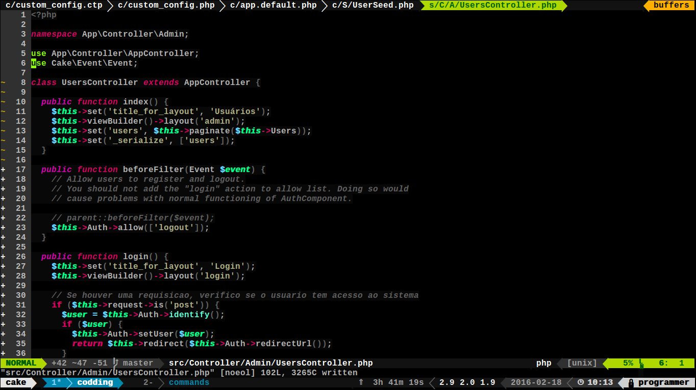

# Hello VIMERS
Olha o que o tio de vocês fez para o vim, espero que gostem
Para usar este tema basta cloná-lo no seu diretório .vim que fica na home do sistema operacional
e depois adicionar no .vimrc que igualmente na home com o seguinte trecho
```vim
# No seu .vimrc ou configuração padrão
colorscheme 'black-coffee-molokai'

```
Se dé algum problema, basta submeter uma Issue aqui pro seu tio Caio Cutrim, beleza?

# Aqui vão algumas screenshots do tema





Obs.: O tema não tem suporte para gvim, seja hackudo e uso a PORRA DE UM TERMINAL NESSE CARALEO. :3
Obs.: Perdoe a PORRA dos palavrões. <3
